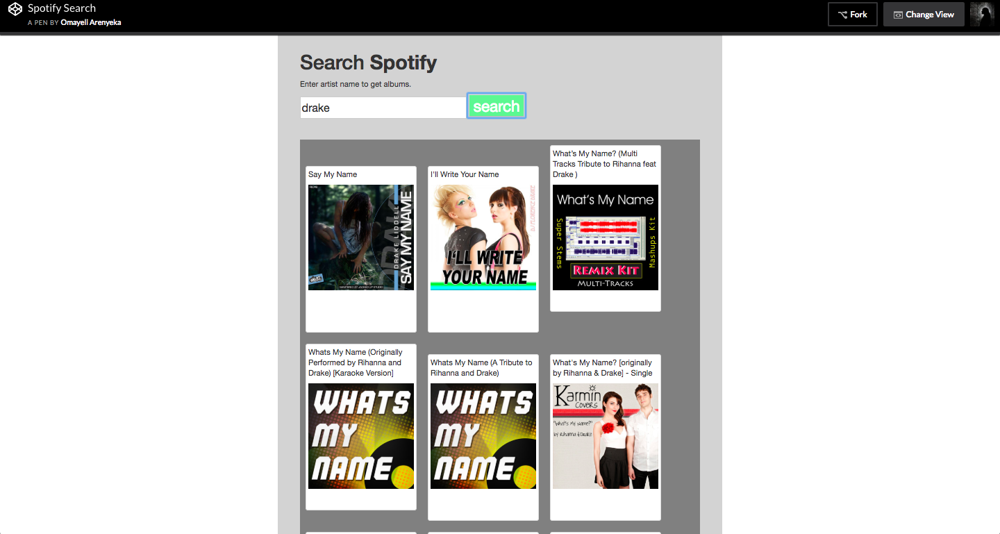

Run with: `python -m SimpleHTTPServer 8000` or [View on Codepen](https://codepen.io/yelly/pen/vrKxWy)

- [Spotify API](https://developer.spotify.com/documentation/web-api/quick-start/)
- [Get OAuth Token](https://developer.spotify.com/console/get-artist-albums/)

# Resources

- [Intro to Bootstrap](https://getbootstrap.com/docs/4.0/getting-started/introduction/)
- [Introduction to web APIs](https://developer.mozilla.org/en-US/docs/Learn/JavaScript/Client-side_web_APIs/Introduction)
