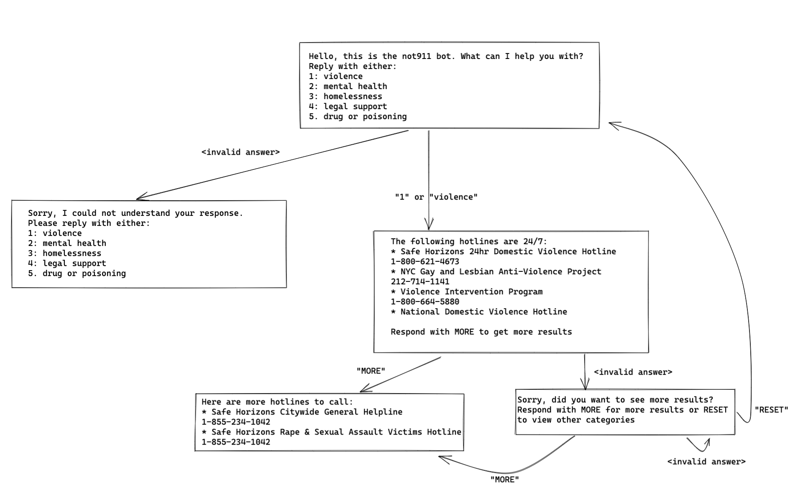

# Chat Bot

### Objective

Have a working text-message bot that replies in a conversation
Requirements:

- Basic understanding of requests/response
- Comprehension of Javascript basics like using variables and if-statements.
- Twilio account (free to create one).
- Phone number to test. You can set up a free phone number through [Google Voice](https://voice.google.com/u/0/about).

   Example here: [https://glitch.com/~not911-bot](https://glitch.com/~not911-bot). 
   This is a chat bot that allows you to get information found from [not911.nyc](https://not911.nyc)

### Instructions

1. Come up with an idea for a chat bot. Chat bots are essentially programs that communicate through messages. In this case, you will be building a chat bot that can be accessed through a phone number. Here are some ideas of useful bots:
   - [Pride Event Bot](https://glitch.com/~pridebot-glitch) - tells you the nearest and latest pride event.
   - [Resist Bot](https://resist.bot/) - automatically sends letters to your local statehouse and more.
   - [Hangman game](https://github.com/mee-kell/guess-the-word) Play hangman through text messages.
   - Chat bots don't need to be serious. They can be fun like a chat bot that plays a guessing game, tic-tac-toe, or tells you whether today you should wear pants or shorts. Some other ideas are bots that tell you when the next MTA train is arriving at a station or a bot that generates a poem for you.
2. Design and build an chat bot using the Twilio API. You can follow the Twilio guide with Node.js to learn how to set up a Twilio account with your node server. It is recommended
   - Design: It’s recommended that you either map out the conversation or create a diagram of possible text messages. Example:
     
3. Start building your bot either on your local computer or on a virtual environment like Glitch or Repl. Some caveats when trying your bot out with Twilio's API:
   - If developing locally, you will need to use a port-fowarding tool (Twilio uses web hooks). Glitch makes this easy because its web server is always running. Check the troubleshooting section for instructions on how to use ngrok.

### Troubleshooting

#### Using ngrok

If you are running your chat bot on your local environment (running on `localhost`), you will need a way to forward your port to a public URL. For an overview of how ngrok works with Twilio, you can check [this video](https://www.youtube.com/watch?v=S1uExj7mMgM) 
out.You can use [ngrok](https://ngrok.com/) to do this:

1. Download and install ngrok by following instructions here: [https://ngrok.com/download](https://ngrok.com/download)
2. In a terminal window, use `ngrok http 80` except replace `80` with the port number you are using for your node server. This command will start a session that forwards your local port to a public URL. It should print out some information about the session including a link that looks like `https://test.ngrok.io`. Keep your Terminal window open.
3. Login to Twilio and go to Messaging -> Services and create a Messaging Service. Fill out the name of the service and click `Skip Setup` on the bottom of the page.
4. Once the service is setup, click on `Integrations` and Check `Send a webhook` and copy/paste the URL from your Terminal session. For `Fallback URL` you can just use `https://www.google.com`. Then click `Save Changes`.
5. Your local Node server should now be able to receive Twilio messages. When you are done using Node server, you can close your Terminal window.
