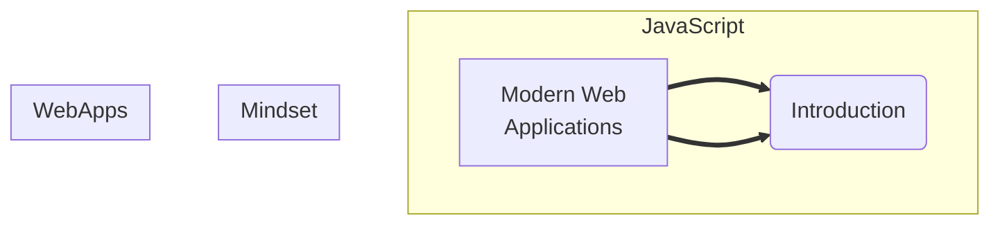

# Javascript & Developer Mindset

There are 3 objectives to this part of the curriculum:

1. [Develop the ability to read and write basic Javascript.](objectives/javascript.md)
2. [Develop a healthy coding mentality.](objectives/developerMindset.md)
3. [Develop a basic understanding of how modern web applications.](objectives/webArchitecture)

