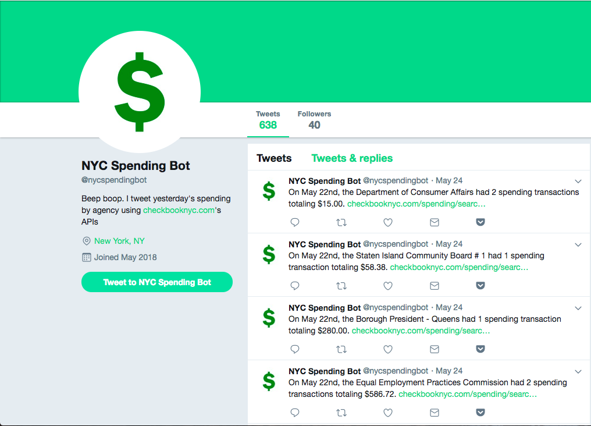
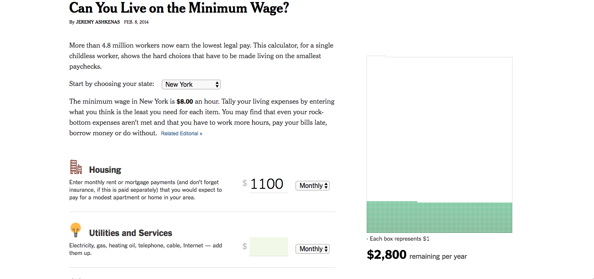
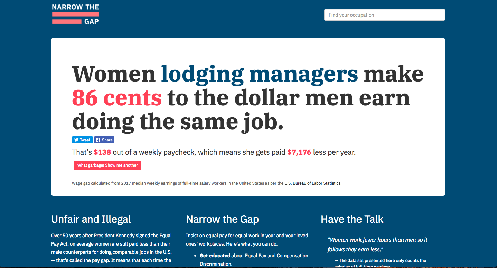
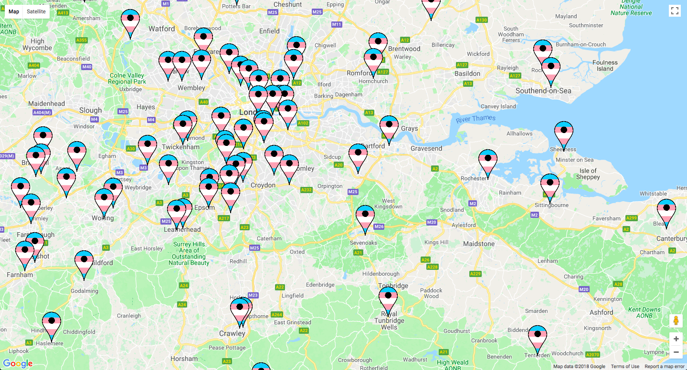
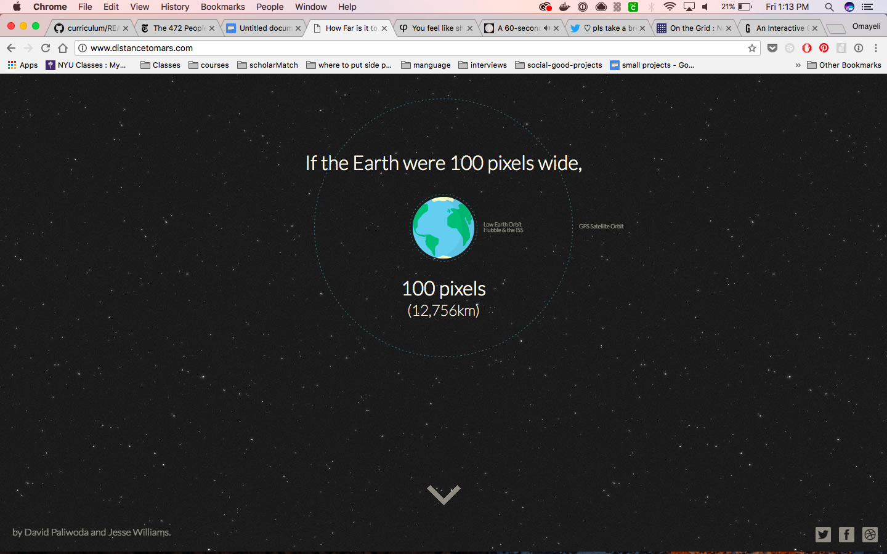
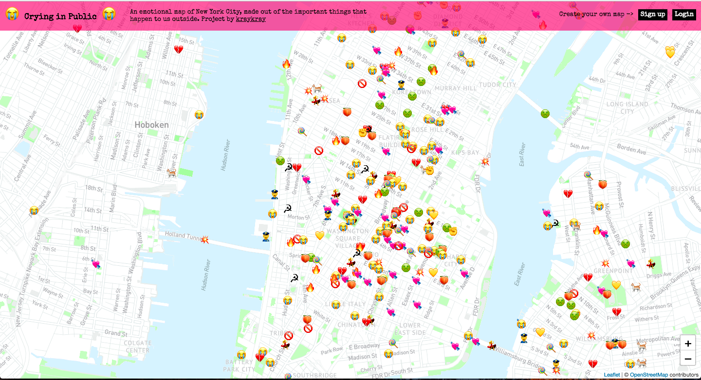
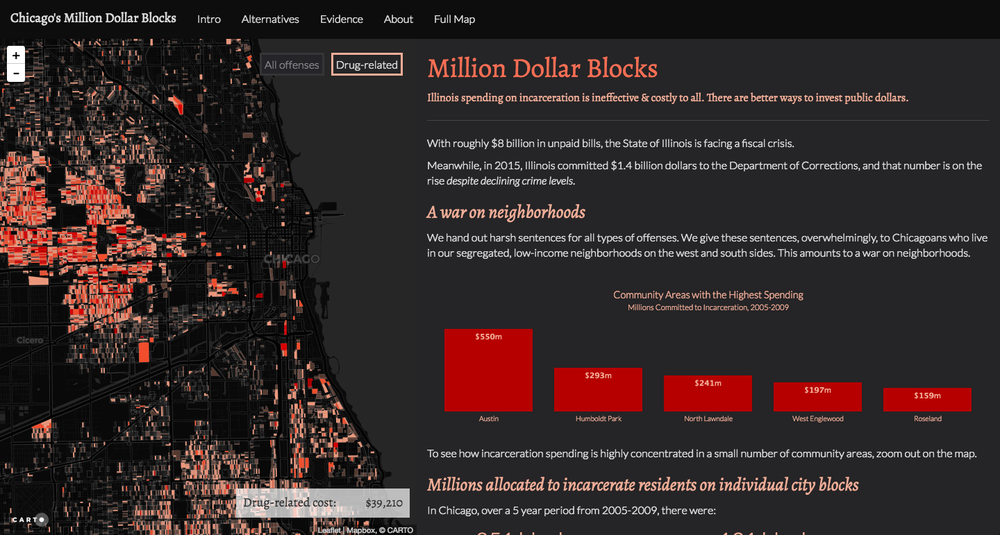

[NYC Spending Bot](https://twitter.com/nycspendingbot)

[A Dictionary of Acronyms](http://keepingup.io/)

[Trump Twitter Insults](https://www.nytimes.com/interactive/2016/01/28/upshot/donald-trump-twitter-insults.html)

[Election Rewind](http://electionrewind.com/)

[Abortion Clinics](https://pudding.cool/2017/09/clinics/)

[Minimum Wage](https://www.nytimes.com/interactive/2014/02/09/opinion/minimum-wage.html)

[White Collar Crime Risk Zones](http://whitecollar.thenewinquiry.com/)

White Collar Crime Risk Zones uses machine learning to predict where
financial crimes are mostly likely to occur across the US.

[Justice for Saheed](http://www.justiceforsaheed.com/)

[Twitter Demetricator](https://bengrosser.com/projects/twitter-demetricator/)

A browser extension that hides all the metrics on Twitter

[NYPD Edits](https://twitter.com/NYPDedits)

I’m a bot that tweets anonymous Wikipedia edits that are made from IP
addresses in the NYPD. (After an article revealing computers operating
on the New York Police Department’s computer network at its 1 Police
Plaza headquarters have been used to alter Wikipedia pages containing
details of alleged police brutality.

[Appolition](https://appolition.us/)

Automatically give your spare change from everyday purchases to help
prevent the detrimental impact this has on our community.

[Pulled Over](https://pulledover.us)

[Rapistify Extension](https://github.com/m0neysha/rapistify-extension)

A chrome extension that corrects articles about Brock Turner
Stanford-rape case.

[Last Words](http://tinysubversions.com/stuff/lastwords/)

Occurrences of 'Love' in Last Words of Executed Texas Death Row Inmates.

[remember their name](http://remembertheir.name/)

[Narrow the Gap](https://narrow-the-gap.glitch.me)

[chicago's million dollar blocks](https://chicagosmilliondollarblocks.com)

An interactive visualization of incarceration spending in Chicago

[Trans GP Finder](https://trans-gp-finder.glitch.me/)

Webapp to help you find a trans-friendly GP in your area.
 

[The Water we eat](http://thewaterweeat.com/)

Infographic website about conserving water.

[Largest Vocabulary in Hip Hop](https://pudding.cool/2017/02/vocabulary/)

RAPPERS, RANKED BY THE NUMBER OF UNIQUE WORDS USED IN THEIR LYRICS

[On the grid](https://onthegrid.city/)

On the Grid is the ultimate guide to the world's creative neighborhoods.

[Untitled New York](http://www.unti-tled.com/new-york)

Current art shows in NYC.

[Distance to mars](http://www.distancetomars.com)

Interactive website showing the distance to mars.

[You feel like shit](http://philome.la/jace_harr/you-feel-like-shit-an-interactive-self-care-guide/play)

Interactive guide for when you feel like shit.

[Pixel Thoughts](http://www.pixelthoughts.co)

Put a stressful thought in the star. A 60-second meditation tool to help
clear your mind.

[Vitamin Atlas](https://www.good.is/infographics/vitamin-atlas)

An Interactive Guide to Nutrition and the Human Body

[Muslims Condemn](https://muslimscondemn.com/)

A collection of all the cases where Muslims have condemned wrongdoings
done falsely in the name of Islam.

[Crying in Public](https://cryinginpublic.com/)

An emotional map of New York City, made out of the important things that
happen to us outside.

[Breathe In, Breathe Out](http://xhalr.com/)

[Visualizing 10.6 million jail admissions each year](https://www.prisonpolicy.org/blog/2018/03/22/chalabi/)

[clap all the things](https://clap.glitch.me/)

[Record Player](http://record-player.glitch.me/auth)

Take a picture of a record, play the sound.

======================

[Hair Nah](http://hairnah.com/) 

A travelling game about a black woman tired of people touching her hair.

