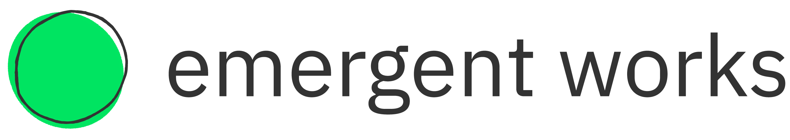

# Phase 2 - Web Fundamentals

This is EW's Phase 2 Mentee Curriculum during the 12 weeks mentorship.
Phase 2 consists of 3 Modules, with each module being 4 weeks.

During the mentorship, the mentor is expected to utilize the Phase 2 curriculum and
adjust the pace of it according to their mentee's needs.

In the curriculum, the mentor will find hyperlinked resources that they can use.

Mentors will also be provided with a <a href="https://docs.google.com/document/d/1zxx33pMIud3dbVyI-OS6yUb64AkhTxDSpJbNCj7lftE/edit" target="_blank">lesson plan template</a> that can be used to structure each lesson in accordance with the curriculum.

Program staff will be of assistance for support with lesson planning if needed.
If a mentee is between phases, such as mentee needs a little from Phase 1 & 2, then the mentor will combine parts of each of the phases to fit the mentee's needs.

### Mentee Starting Skill Level

- Comfortable with navigating various websites and mobile apps
- Difficulty identifying which job/career match their skills
- No or incomplete professional portfolio
- Finished Phase 1 or is proficient in digital literacy

## Module 1: Intro to HTML

### Duration

4 weeks

### Facilitation

1-on-1 Mentorship sessions

### Learning Topics

- Introduction to a visual representation of HTML & CSS
- How does the internet/browser work (session)
- Servers & clients
- Apps vs websites

### Key Mentee Deliverables

- If mentee has started their passion project, make a diagram of their process
- Create a GitHub account
- Set up local development environment
- Creating their first repository and pushing their first commit to Github
- A Content-only draft of passion project (good html markup, but no expectation of styling)

### Learning Outcomes

- Basic familiarity with Git & Github
- Basic familiarity with VS Code
- Understanding basic HTML (and how CSS and JS contribute)
- Concept articulation to a Phase 1 mentee

### Supporting Educational Resources

- The Odin Project
  - <a href="https://www.theodinproject.com/paths/foundations/courses/foundations#introduction" target="_blank">Introduction</a>
  - <a href="https://www.theodinproject.com/paths/foundations/courses/foundations#prerequisites" target="_blank">Prerequisites</a>
  - <a href="https://www.theodinproject.com/paths/foundations/courses/foundations#git-basics" target="_blank">Git Basics</a>
  - <a href="https://www.theodinproject.com/paths/foundations/courses/foundations#html-foundations" target="_blank">HTML Foundations</a>

## Module 2: Deep dive into HTML, CSS

### Duration

4 weeks

### Facilitation

1-on-1 Mentorship sessions

### Learning Topics

- How to run a local web server to start working on your static HTML page
- Structure of HTML page
- Adding metadata to your page
- Style your HTML with CSS
- Using CSS selectors to create classes and reusable styles
- CSS style hierarchy and overrides
- Embedding media with HTML
- Adding web fonts to your page

### Key Mentee Deliverables

- Run a local web server to see your changes in real time
- 1 page website styled with CSS
- Use 1 page website from module 1 and expand to 5 pages with links, embedded media, navigation bar, footer and a new style
- Include a web font on your page
- Add metadata to your page in HTML
- A Styled, but static version draft of passion project (no expectation of interactivity that will come from JavaScript)

### Learning Outcomes

- Comfortable running local web server
- Comfortable creating new webpages with HTML & CSS independently
- Comfortable adding basic interaction to websites
- Comfort styling websites with CSS

### Supporting Educational Resources

- The Odin Project
  - <a href="https://www.theodinproject.com/paths/foundations/courses/foundations#css-foundations" target="_blank">CSS Foundation</a>
  - <a href="https://www.theodinproject.com/paths/foundations/courses/foundations#flexbox" target="_blank">Flexbox</a>

## Module 3: Intro to Javascript

### Duration

4 weeks

### Facilitation

1-on-1 Mentorship sessions

### Learning Topics

- Reading other people’s HTML & CSS (exercise)
- Intro to the Javascript console
- Intro to interactive Javascript
- Using Javascript libraries
- Make a simple game (Tic-Tac-Toe or Rock Paper Scissors or Coin Toss) with your mentor

### Key Mentee Deliverables

- Reproduce the style of your favorite website homepage from scratch in HTML & CSS
- Add basic Javascript to add interactive components like a modal (pop-up) or animations
- Add at least 1 Javascript library to your page to add functionality
- Bonus: deploy your website to Github pages
- Functional initial release of passion project.

### Learning Outcomes

- Using Chrome developer tools to inspect pages
- How to log information in the console
- How to use buttons and modals for basic interaction
- How to use HTML, CSS & Javascript together
- Reinforce Github skills

### Supporting Educational Resources

- The Odin Project
  - <a href="https://www.theodinproject.com/paths/foundations/courses/foundations#javascript-basics" target="_blank">JavaScript Basics</a>
  - Bonus - <a href="https://www.theodinproject.com/paths/foundations/courses/foundations#the-back-end" target="_blank">The Back End</a>
  - <a href="https://www.theodinproject.com/paths/foundations/courses/foundations#conclusion" target="_blank">Conclusion</a>

### Check out

- [Supplemental and Alternative Materials](supplemental.md)
